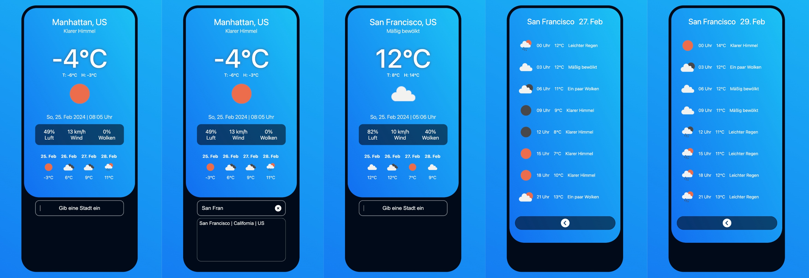
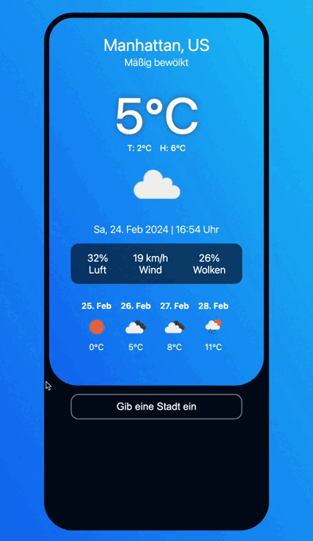

# SuperCode Mobile Weather App

## Purpose of the website

- Create a mobile weather app
- Let the user enter any city input and show the weather data for that city
- Show the available cities as a selection during user input
- Get the information via the APIs from openweathermap.org/api
- Show the weather data of the current day
- Show a weather forecast for the following 5 days
- Show the weather details by time for any day of the 5-day preview on a separate detail page

## Built with

- Mobile Design
- Flexbox Layout
- JavaScript ES6+
- Fetch-API

## Links

- [See live site here](https://thomaserdmenger.github.io/superCode-Weather-App)
- [GitHub Repository](https://github.com/thomaserdmenger/superCode-Weather-App)
- [GitHub Author](https://github.com/thomaserdmenger)
- [LinkedIn Author](https://www.linkedin.com/in/thomaserdmenger/)

## Screenshot-Image

## Screenshot-GIF

